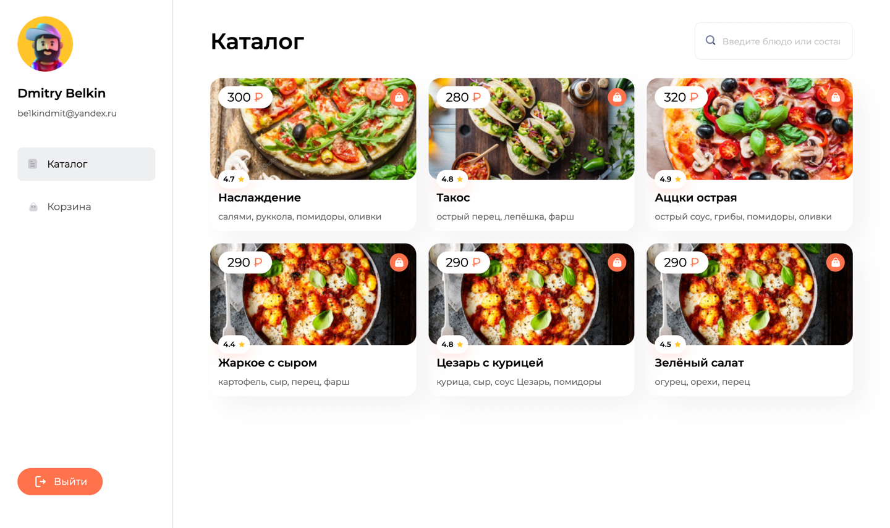

# Pizzeria app

The repository contains a client-side implementation for a pizzeria application.

## Tech Stack
- React
- TypeScript
- React-router-dom
- Redux

## Installation
To run the project locally, follow these steps:
```bash
git clone https://github.com/belk1ng/pizza-frontend.git
cd pizza-frontend
yarn install
yarn dev
```

## Preview
